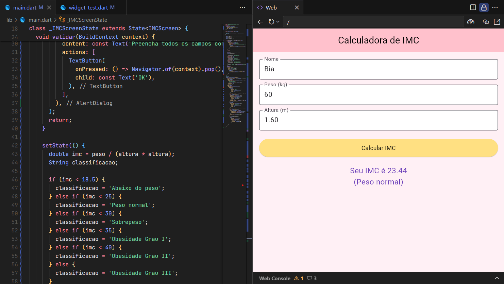
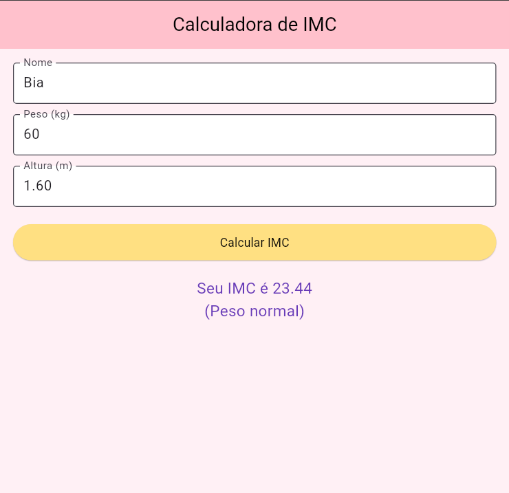

# AvaliacaoIMC

# Calculadora de IMC - Flutter

## Descrição
Aplicativo para cálculo de Índice de Massa Corporal (IMC) desenvolvido em Flutter com:
- Entrada de peso e altura
- Cálculo automático
- Exibição do resultado em AlertDialog

## Tecnologias
- Flutter 
- Dart 
- Vs Code
- Fire Base 

## Print da Tela

## ▶ Como Executar
